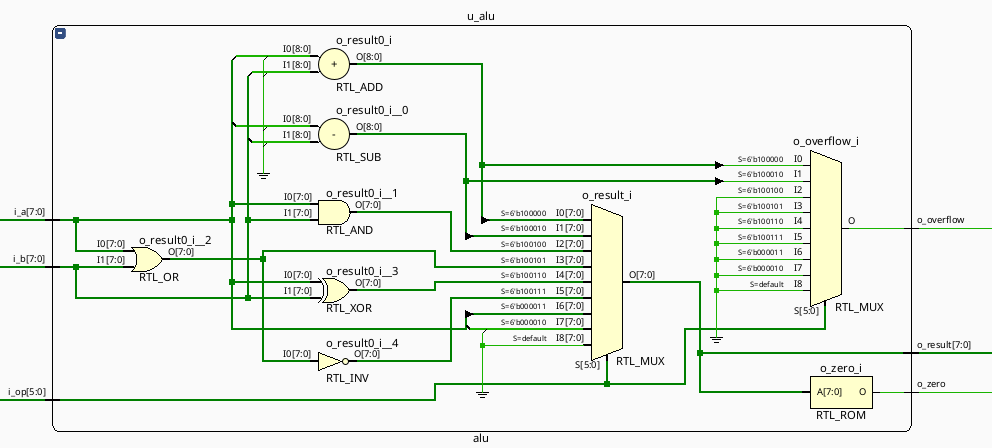
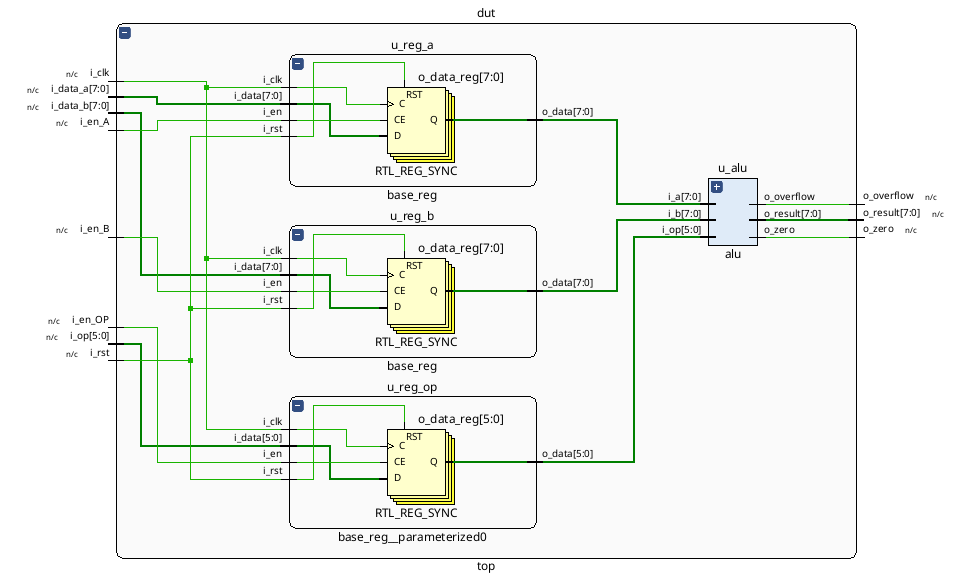

# 🔢 ALU - Arithmetic Logic Unit

## 📋 Descripción

Este proyecto implementa una **ALU (Arithmetic Logic Unit)** completa en Verilog, diseñada como parte del curso de Arquitectura de Computadoras. La ALU es un componente fundamental de cualquier procesador, capaz de realizar operaciones aritméticas y lógicas sobre datos binarios.

### 🎯 Características Principales

- **8 operaciones** implementadas (aritméticas y lógicas)
- **Arquitectura parameterizable** con ancho de datos configurable
- **Registros base** para almacenamiento de operandos
- **Flags de estado** (zero, overflow)
- **Testbench con casos de prueba** utilizando datos aleatorios
- **Script de simulación** automatizado

## 🏗️ Arquitectura del Sistema

El proyecto está estructurado en tres módulos principales:

### 1. 🧮 Módulo ALU (`alu.v`)

- **Entrada**: Dos operandos de N bits + código de operación
- **Salida**: Resultado de N bits + flags de estado
- **Operaciones soportadas**:
  - `ADD` (100000): Suma aritmética
  - `SUB` (100010): Resta aritmética  
  - `AND` (100100): AND lógico bit a bit
  - `OR`  (100101): OR lógico bit a bit
  - `XOR` (100110): XOR lógico bit a bit
  - `NOR` (100111): NOR lógico bit a bit
  - `SRA` (000011): Shift aritmético a la derecha
  - `SRL` (000010): Shift lógico a la derecha

### 2. 📝 Módulo Registro Base (`base_reg.v`)

- **Función**: Almacenamiento temporal de datos
- **Características**: 
  - Enable de escritura independiente
  - Reset asíncrono
  - Ancho parametrizable

### 3. 🔗 Módulo TOP (`top.v`)

- **Función**: Integración completa del sistema
- **Componentes**: 3 registros base (2 operandos y 1 opcode) + 1 ALU
- **Interface**: Entrada multipropósito de 8 bits con control de carga independiente
- **Características especiales**:
  - **Entrada única**: `i_data[7:0]` sirve para cargar datos A, B y operación
  - **Control por enables**: Cada enable determina qué registro se actualiza
  - **Operación de 6 bits**: Solo los 6 LSB se usan para el código de operación
- **Interface**: Control de carga independiente para cada operando y operación

## ⚙️ Esquemático

A continuación se presentan los diagramas esquemáticos de los módulos principales del proyecto:

### Esquemático del Módulo ALU



El diagrama muestra la estructura interna de la ALU con sus entradas, salidas y la lógica de selección de operaciones.

### Esquemático del Módulo TOP



El diagrama presenta la integración completa del sistema, mostrando cómo se conectan los registros base con la ALU para formar el módulo TOP.

## 📥 Instalación y Configuración

### Prerrequisitos

```bash
# Ubuntu/Debian
sudo apt-get update
sudo apt-get install -y iverilog gtkwave
```

### Descarga del Proyecto

```bash
# Clonar el repositorio
git clone https://github.com/iledesma08/ALU.git
cd ALU
```

## 🔧 Implementación en Hardware (Basys3)

El proyecto incluye un archivo de constraints (`constraints/basys3.xdc`) configurado para la placa Basys3 FPGA:

### 🎛️ Mapeo de Pines

- **Clock**: 100MHz del sistema (pin W5)
- **Reset**: Botón central (btnC - pin U18)
- **Datos**: 8 switches (SW7-SW0) como entrada multipropósito
- **Controles**:
  - `i_en_A`: Botón superior (btnU - pin T18)
  - `i_en_B`: Botón izquierdo (btnL - pin W19)
  - `i_en_OP`: Botón derecho (btnR - pin T17)
- **Resultados**: LEDs LD7-LD0 para el resultado de 8 bits
- **Flags**: LD8 (zero), LD9 (overflow)

### 🚀 Modo de Uso en Hardware

1. **Configurar operando A**: Ajustar switches SW7-SW0 y presionar btnU
2. **Configurar operando B**: Ajustar switches SW7-SW0 y presionar btnL  
3. **Configurar operación**: Ajustar switches SW5-SW0 con el código de operación y presionar btnR
4. **Ver resultado**: Los LEDs LD7-LD0 muestran el resultado, LD8 indica zero, LD9 indica overflow
5. **Reset**: Presionar btnC para reiniciar todos los registros

### 🛠️ Guía de Implementación en Vivado

Sigue estos pasos para sintetizar e implementar el proyecto en la placa Basys3 usando Xilinx Vivado:

#### 1. **Crear Nuevo Proyecto**

- **File** → **New Project**
- Nombre: `ALU_Basys3`
- **Next** → **RTL Project** → **Next**

#### 2. **Agregar Archivos Fuente**

- **Add Sources** → **Add or create design sources**
- Agregar archivos en este orden:
  - `src/base_reg.v`
  - `src/alu.v` 
  - `src/top.v` (marcar como **top module**)

#### 3. **Agregar Constraints**

- **Add Sources** → **Add or create constraints**
- Agregar: `constraints/basys3.xdc`

#### 4. **Configurar Dispositivo**

- **Project Settings** → **Project Device**
- Seleccionar: **xc7a35tcpg236-1** (Basys3)

#### 5. **Síntesis e Implementación**

1. **Run Synthesis** (esperar completion)
2. **Run Implementation** (esperar completion)
3. **Generate Bitstream**

#### 6. **Programar FPGA**

- Conectar la placa Basys3 via USB
- **Open Hardware Manager**
- **Auto Connect**
- **Program Device** → seleccionar el archivo `.bit` generado

#### 7. **Verificación**

- Los switches y botones deberían controlar la ALU según el mapeo definido
- Los LEDs mostrarán el resultado y flags en tiempo real

## 🧪 Testbench

### Script de Simulación

```bash
# Ejecutar script de simulación interactivo
./test.sh

# El script preguntará qué módulo probar:
# 1) TOP - Test completo del sistema
# 2) Quit - Salir
```

### Funcionamiento del Script

El script `test.sh` automatiza todo el proceso:

1. **Verificación de herramientas**: Confirma que `iverilog` y `vvp` están instalados
2. **Compilación**: Compila automáticamente los módulos fuente y testbench
3. **Simulación**: Ejecuta la simulación con el testbench
4. **Resultados**: Muestra los resultados en tiempo real
5. **Cleanup**: Limpia archivos temporales automáticamente

### Casos de Prueba

El testbench automatizado incluye:

- **50 tests aleatorios** con datos generados pseudo-aleatoriamente
- **Sincronización por clock** para timing realista
- **Verificación automática** de resultados esperados vs obtenidos
- **Cobertura completa** de todas las operaciones
- **Validación de flags** (zero, overflow)
- **Reporte detallado** de pass/fail por test

#### Ejemplo de Salida de Test

```text
TESTBENCH para módulo TOP - ALU con registros
============================================================
Parámetros: NB_DATA=8, NB_OP=6
Operaciones soportadas: ADD, SUB, AND, OR, XOR, NOR, SRA, SRL

PASS [1] - SUB: A=36, B=129 -> Result=163 (zero=0, overflow=1)
PASS [2] - NOR: A=99, B=13 -> Result=144 (zero=0, overflow=0)
PASS [3] - SUB: A=101, B=18 -> Result=83 (zero=0, overflow=0)
...
Tests ejecutados: 50
Tests pasados: 50
Tests fallidos: 0
Tasa de éxito: 100.0%
✓ TODOS LOS TESTS PASARON!
```

## 📁 Estructura del Proyecto

```text
ALU/
├── 📂 src/                    # Código fuente Verilog
│   ├── alu.v                  # Módulo ALU principal
│   ├── base_reg.v             # Registro base
│   └── top.v                  # Módulo de integración
├── 📂 test/                   # Testing y validación
│   └── test_top.v             # Testbench principal
├── 📂 docs/                   # Documentación y esquemáticos
│   ├── alu.png                # Esquemático del módulo ALU
│   └── top.png                # Esquemático del módulo TOP
├── 📂 constraints/            # Archivos de constraints para FPGA
│   └── basys3.xdc            # Constraints para placa Basys3
├── 📄 test.sh                 # Script de simulación automatizado
├── 📄 .gitignore              # Archivos ignorados por Git
├── 📄 LICENSE                 # Licencia del proyecto
└── 📄 README.md               # Esta documentación
```

## 🎛️ Personalización

### Parámetros Configurables

```verilog
// En top.v - Ejemplo de instanciación personalizada
top #(
    .NB_DATA(16),    // Cambiar ancho de datos a 16 bits
    .NB_OP(6)        // Mantener 6 bits para operaciones
) mi_alu (
    // ... conexiones ...
);
```

## 🤝 Contribuciones

¡Las contribuciones son bienvenidas! Por favor sigue estas pautas:

### 🔄 Proceso de Contribución

1. **Fork** el repositorio
2. **Crea** una rama feature (`git checkout -b feature/nueva-operacion`)
3. **Implementa** tus cambios siguiendo el estilo del código
4. **Ejecuta** los tests localmente (`./test.sh`)
5. **Commit** con mensajes descriptivos (`git commit -m 'Add: nueva operación XYZ'`)
6. **Push** a tu rama (`git push origin feature/nueva-operacion`)
7. **Abre** un Pull Request con descripción detallada

### ✅ Checklist de Contribución

- [ ] Tests pasan localmente (`./test.sh`)
- [ ] Código sigue convenciones de Verilog
- [ ] Documentación actualizada si es necesario
- [ ] Commits tienen mensajes descriptivos
- [ ] Módulos compilan sin errores o warnings

### 📝 Estilo de Código

- **Indentación**: 4 espacios
- **Naming**: `snake_case` para señales, `UPPER_CASE` para parámetros
- **Comentarios**: Documenta bloques complejos y parámetros
- **Modularidad**: Mantén módulos pequeños y cohesivos

### ➕ Agregar Nuevas Operaciones

1. Definir nuevo código de operación en `alu.v`
2. Implementar lógica en el bloque `always`
3. Actualizar testbench con casos de prueba
4. Ejecutar tests de validación

### 🔌 Soporte para Otras FPGAs

Para agregar soporte a otras placas FPGA, crea nuevos archivos de constraints:

#### **Proceso de Adaptación**

1. **Crear archivo de constraints**:
   ```bash
   # Ejemplo para otras placas
   touch constraints/arty_a7.xdc      # Para Arty A7
   touch constraints/zybo_z7.xdc      # Para Zybo Z7
   touch constraints/nexys4_ddr.xdc   # Para Nexys 4 DDR
   ```

2. **Mapear pines específicos**:
   - Consultar el manual de la placa objetivo
   - Identificar pines de switches, botones, LEDs y clock
   - Adaptar el mapeo manteniendo la funcionalidad

3. **Ejemplo de adaptación**:
   ```verilog
   ## Para Arty A7 - Ejemplo de mapeo alternativo
   ## Clock 100MHz
   set_property -dict { PACKAGE_PIN E3    IOSTANDARD LVCMOS33 } [get_ports i_clk]
   
   ## Switches (4 disponibles en Arty A7)
   set_property -dict { PACKAGE_PIN A8    IOSTANDARD LVCMOS33 } [get_ports {i_data[0]}]
   set_property -dict { PACKAGE_PIN C11   IOSTANDARD LVCMOS33 } [get_ports {i_data[1]}]
   # ... continuar con pines disponibles
   ```

4. **Documentar cambios**:
   - Actualizar README con nueva placa soportada
   - Incluir diagrama de pines si es necesario
   - Agregar instrucciones específicas de la placa

#### **Guidelines para Nuevos Constraints**

- **Naming**: `constraints/[nombre_placa].xdc`
- **Comentarios**: Documentar cada sección de pines
- **Compatibilidad**: Mantener nombres de señales consistentes
- **Testing**: Verificar que los constraints compilan sin errores

## 📄 Licencia

Este proyecto está licenciado bajo la **MIT License**. Ver el archivo [LICENSE](LICENSE) para más detalles.
